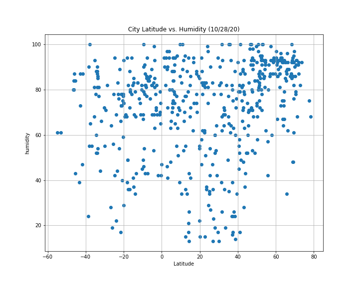
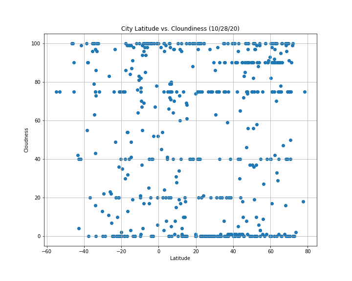
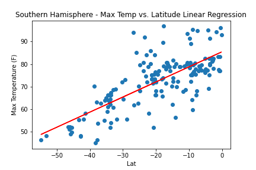
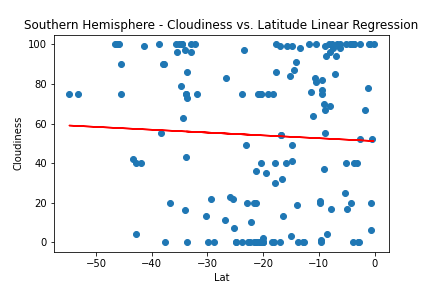
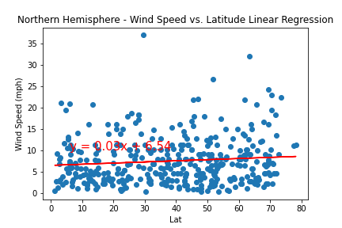
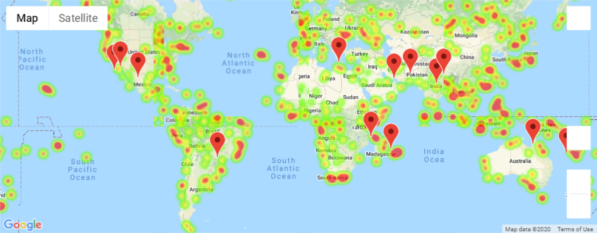

# Python-API-Challenge- What's the Weather like?

How to manipulate data to find ideal vacation spots across the globe? Let me show you!  

## Part 1. WeatherPy

In this part, I have created a Python script to visualize the weather of 500+ random (non-repeating) cities across the world of varying distance from the equator. I have used a simple Python library- citipy- and the OpenWeatherMap API, to create a representative model of weather across world cities and performing a weather check on each of the cities using a series of successive API calls.

The two objectives of this exercise are:

### 1. Generate various scattered plots showing correlation between:
* [Latitude vs Temperature](#Latitude_vs_Temperature)
* [Latitude vs Humidity](#Latitude_vs_Humidity)
* [Latitude vs Cloudiness](#Latitude_vs_Cloudiness)
* [Latitude vs WindSpeed](#Latitude_vs_WindSpeed)

### 2. Run Linear Regression for Northern and Southern Hemisphere for:
* [Northern Hemisphere Temperature vs Latitude](#Northern_Hemisphere_Temperture_vs_Latitude)
* [Southern Hemisphere Temperature vs Latitude](#Southern_Hemisphere_Temperture_vs_Latitude)
* [Northern Hemisphere Humidity vs Latitude](#Northern_Hemisphere_Humidity_vs_Latitude)
* [Southern Hemisphere Humidity vs Latitude](#Southern_Hemisphere_Humidity_vs_Latitude)
* [Northern Hemisphere Cloudiness vs Latitude](#Northern_Hemisphere_Cloudiness_vs_Latitude)
* [Southern Hemisphere Cloudiness vs Latitude](#Southern_Hemisphere_Cloudiness_vs_Latitude)
* [Northern Hemisphere Wind Speed vs Latitude](#Northern_Hemisphere_Wind_Speed_vs_Latitude)
* [Southern Hemisphere Wind Speed vs Latitude](#Southern_Hemisphere_Wind_Speed_vs_Latitude)

### Scattered Plots

#### Latitude_vs_Temperature
<table>
  <tr>
    <td></td>
  <tr>
<table>
* Above plot shows that temperatures are higher as you get closer to the equator. 

#### Latitude_vs_Humidity
<table>
  <tr>
    <td></td>
  <tr>
<table>
* Above plot shows that humidity is relatively consistant across all latitudes. 
    
#### Latitude_vs_Cloudiness
<table>
  <tr>
    <td></td>
  <tr>
<table>
* Above plot shows that cloudiness is relatively consistant across all latitudes.
    
#### Latitude_vs_WindSpeed
<table>
  <tr>
    <td></td>
  <tr>
<table>
* Above plot shows that Wind Speed is somewhat indiffernt to the latitudes but if you notice that Wind Speed outliners all are at latitudes furthest from equator. 
    
### Linear Regrissions

#### Northern Hemisphere Temperature vs Latitude
<table>
  <tr>
    <td></td>
  <tr>
<table>
    
#### Southern Hemisphere Temperature vs Latitude
<table>
  <tr>
    <td></td>
  <tr>
<table>

#### Northern Hemisphere Humidity vs Latitude
<table>
  <tr>
    <td></td>
  <tr>
<table>
 
#### Southern Hemisphere Humidity vs Latitude
<table>
  <tr>
    <td></td>
  <tr>
<table>
    
#### Northern Hemisphere Cloudiness vs Latitude
<table>
  <tr>
    <td></td>
  <tr>
<table>
    
#### Southern Hemisphere Cloudiness vs Latitude
<table>
  <tr>
    <td></td>
  <tr>
<table>
    
#### Northern Hemisphere Wind Speed vs Latitude
<table>
  <tr>
    <td></td>
  <tr>
<table>
    
#### Southern Hemisphere Wind Speed vs Latitude
<table>
  <tr>
    <td></td>
  <tr>
<table>
    
## Part 2. VacationPy
In this part I have created Python script to export data created in part 1 and use that data to generate heat maps for cities with ideal variables for best vacation spot of choice. Once that was done, using google places API, I created a list of hotels that were in 5000 meters radius from the ideal cities. I used markers to locate them on goole map on top of the heat map. 
    
#### Heat Map of Ideal Cities
<table>
  <tr>
    <td></td>
  <tr>
<table>
* Above heat map shows humidity of cities from part one.
    
#### Heat Map of Ideal Cities
<table>
  <tr>
    <td></td>
  <tr>
<table>
* Above heat map shows hotels in the citi radius of 5000 meters that has below variables:
  1. Temperature between 70 and 80 (F)
  2. Zero Cloudiness
  3. Wind Speed less than 10
    
## Data Source
1. CitiPy: https://pypi.python.org/pypi/citipy
2. OpenWeather: https://openweathermap.org/api
